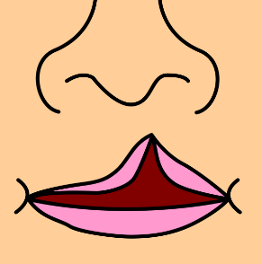
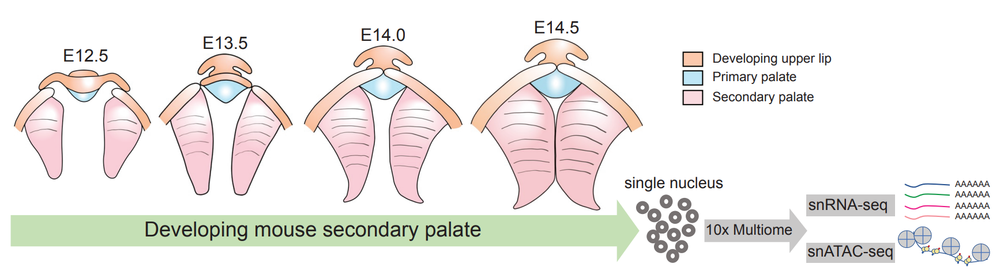
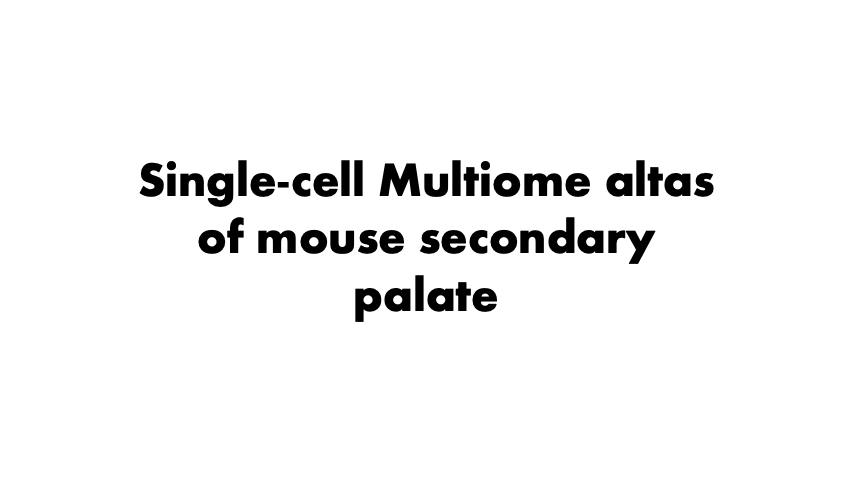

# Single-cell multiomics decodes regulatory programs for mouse secondary palate development
Perturbation in gene regulation during palatogenesis lead to **cleft palate**, one of the most common congenital birth defects. However, **there is lack of a comprehensive multiomic map** of the developing secondary palate at single-cell resolution. 

In this study, we performed **single-cell multiome sequencing (10x Multiome)** of mouse secondary palate across embryonic days (E) 12.5, E13.5, E14.0, and E14.5. For more info please see our [paper](https://www.nature.com/articles/s41467-024-45199-x).

## Animated summary of study

## Reproducibility
To reproduce the analysis and figures presented in our manuscript please see the [Reproducibility](https://github.com/fangfang0906/Single_cell_multiome_palate/tree/master/Reproducibility) folder.

## Data availability
### raw dataset
Check out our raw datasets and description at [GSE218576](https://www.ncbi.nlm.nih.gov/geo/query/acc.cgi?acc=GSE218576).
The processed data can be downloaded at https://drive.google.com/file/d/1VfIQQ4Uy6rf9HEaUbHnC3lpfsSmpdjrX/view?usp=sharing.

## Citation
Please cite our manuscript [bioRxiv preprint](https://www.biorxiv.org/content/10.1101/2022.11.02.514609v1.abstract).
